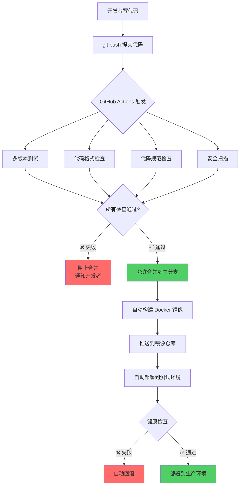
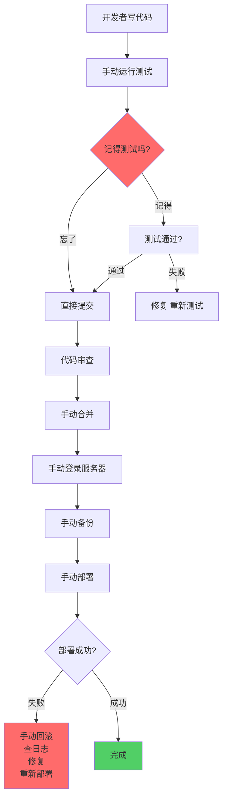
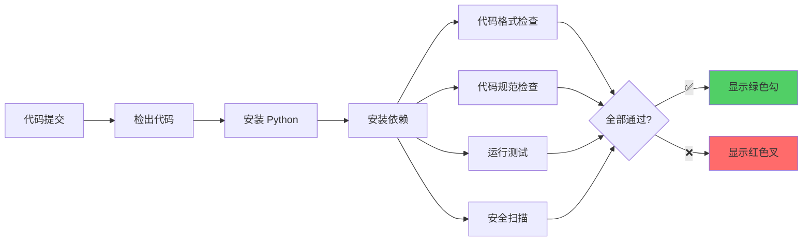
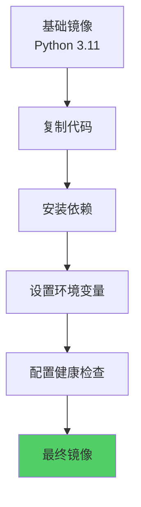
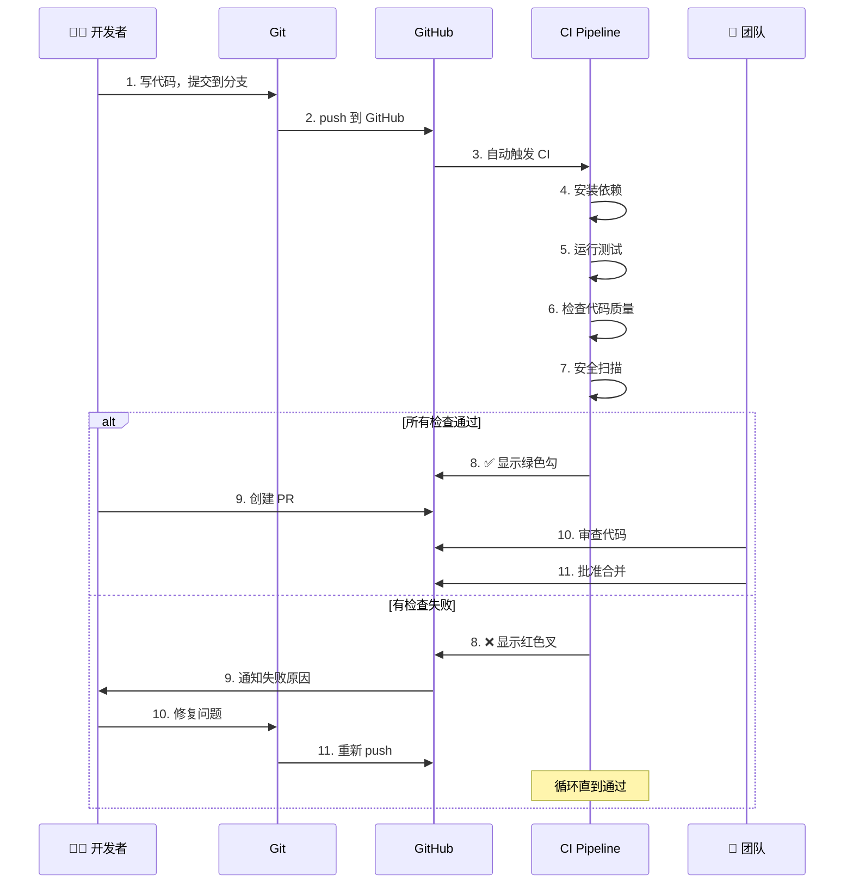
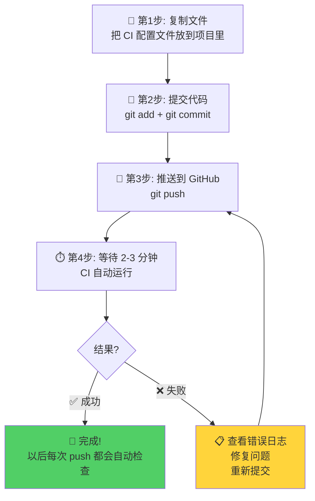
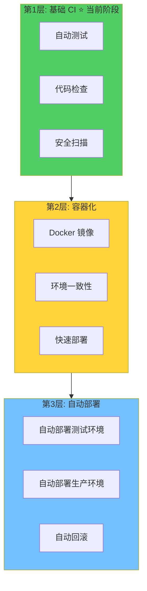
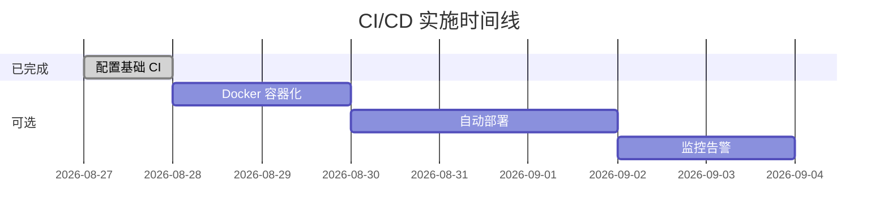
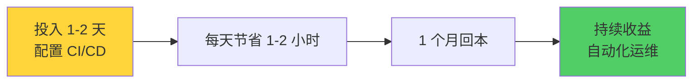
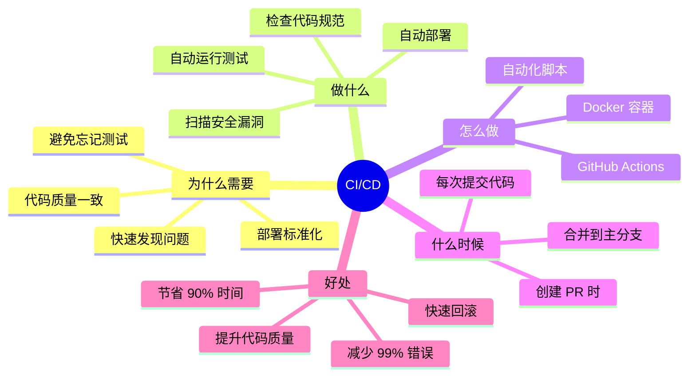

# CI/CD 快速入门指南 - 从零开始

## 🤔 什么是 CI/CD？

**CI (持续集成)**: 每次代码提交，自动测试  
**CD (持续部署)**: 测试通过后，自动部署

### 类比理解

```
传统方式（手工作坊）:
开发者写完代码 → 手动测试 → 发现问题 → 修复 → 再测试 → 手动部署
⏰ 耗时: 2-3 小时，容易出错

CI/CD 方式（自动化工厂）:
开发者写完代码 → 自动测试 → 自动检查 → 自动部署
⏰ 耗时: 5-10 分钟，几乎不出错
```

---

## 🎯 为什么需要 CI/CD？

### 问题场景

#### 场景 1：代码改坏了不知道

```
❌ 没有 CI/CD:
张三修改了支付模块 → 提交代码 → 下班回家
第二天用户反馈支付失败 → 紧急修复 → 加班到深夜

✅ 有 CI/CD:
张三修改了支付模块 → 提交代码 → CI 自动测试失败 → 立即发现问题
修复后再提交 → CI 测试通过 → 安心下班
```

#### 场景 2：代码风格不统一

```
❌ 没有 CI/CD:
张三: 用 tab 缩进，行长 80
李四: 用 4 空格，行长 120
王五: 用 2 空格，行长 100
→ 代码合并时冲突频繁，难以阅读

✅ 有 CI/CD:
所有代码提交 → CI 自动检查格式 → 不符合规范自动拒绝
→ 整个项目代码风格统一
```

#### 场景 3：部署出错难回滚

```
❌ 没有 CI/CD:
手动部署 → 配置错误 → 服务挂了 → 手忙脚乱找备份 → 1小时后恢复

✅ 有 CI/CD:
自动部署 → 健康检查失败 → 自动回滚 → 10秒恢复
```

---

## 📊 CI/CD 工作流程图

### 完整流程



### 没有 CI/CD 的流程



---

## 📁 每个文件的作用

### 核心文件地图

```
项目根目录/
│
├── .github/                          🤖 GitHub 自动化配置
│   ├── workflows/
│   │   └── ci.yml                    ⭐ CI 流水线配置（核心）
│   └── pull_request_template.md     📝 PR 检查清单
│
├── src/                              💻 源代码
├── tests/                            ✅ 测试代码
├── tools/                            🔧 工具代码
│
├── Dockerfile                        🐳 容器化配置
├── .dockerignore                     🚫 Docker 忽略文件
├── requirements.txt                  📦 依赖列表
├── pyproject.toml                    ⚙️ Python 项目配置
└── .flake8                          🔍 代码检查配置
```

### 文件详解

#### 1. `.github/workflows/ci.yml` - CI 流水线（最重要）

**作用**: 自动化测试和检查的大脑

```yaml
# 触发条件
on:
  push:              # 每次 push 触发
  pull_request:      # 每次创建 PR 触发

# 要做的事情
jobs:
  test:              # 运行测试
  security:          # 安全扫描
```

**流程图**:



**实际效果**:

```
你的 GitHub 仓库上会看到:

✅ CI Pipeline passed (所有检查通过)
   ✓ test (Python 3.10) - 2m 34s
   ✓ test (Python 3.11) - 2m 28s  
   ✓ test (Python 3.12) - 2m 31s
   ✓ security - 1m 12s

或者

❌ CI Pipeline failed (有检查失败)
   ✓ test (Python 3.10) - 2m 34s
   ✗ test (Python 3.11) - 0m 15s (代码格式不符合规范)
   ✓ security - 1m 12s
```

#### 2. `.github/pull_request_template.md` - PR 模板

**作用**: 提醒你 PR 需要做什么

**效果**:

```
当你创建 PR 时，自动填充这个模板:

## 变更描述
[你写: 修复了支付接口的超时问题]

## 变更类型
- [x] Bug 修复 ← 你勾选这个
- [ ] 新功能
- [ ] 文档更新

## 测试检查
- [x] 所有单元测试通过 ← 你确认这个
- [x] 添加了新的测试用例
- [x] 手动测试通过
```

**为什么需要**:

```
❌ 没有模板:
开发者创建 PR → 标题随便写 → 没说改了什么 → 审查者不知道要看什么
→ 来回问 → 浪费时间

✅ 有模板:
开发者创建 PR → 按模板填写 → 清晰说明改动 → 审查者快速理解
→ 高效审查
```

#### 3. `Dockerfile` - 容器化配置

**作用**: 把你的应用打包成一个"集装箱"

**类比**:

```
传统部署（搬家）:
- 服务器 A: Python 3.10, 依赖版本 X
- 服务器 B: Python 3.11, 依赖版本 Y
→ "在我机器上能跑" 问题

Docker 部署（集装箱）:
- 所有东西打包在一起
- 在任何地方都一样
→ 环境一致性
```

**Dockerfile 做什么**:



**实际使用**:

```bash
# 构建镜像
docker build -t incident-classifier .

# 运行容器
docker run -d incident-classifier

# 结果: 应用在容器里运行，环境完全一致
```

#### 4. `requirements.txt` - 依赖列表

**作用**: 列出项目需要哪些 Python 包

**内容示例**:

```txt
openai>=1.3.0        # 调用 LLM
python-dotenv>=1.0.0 # 读取环境变量
pydantic>=2.0.0      # 数据验证
pytest>=7.4.0        # 测试框架
black>=23.0.0        # 代码格式化
```

**为什么需要**:

```
❌ 没有 requirements.txt:
同事 A: pip install openai (安装最新版 1.5.0)
同事 B: pip install openai (安装最新版 1.3.0)
→ 版本不一致，出现奇怪问题

✅ 有 requirements.txt:
所有人: pip install -r requirements.txt
→ 所有人使用完全相同的版本
```

#### 5. `pyproject.toml` - 项目配置

**作用**: 配置代码格式化工具和测试工具

**内容示例**:

```toml
[tool.black]
line-length = 120      # 每行最多 120 字符

[tool.pytest.ini_options]
testpaths = ["tests"]  # 测试文件在哪里
```

**为什么需要**:

```
统一配置 → 所有人使用相同规则 → 代码风格一致
```

#### 6. `.flake8` - 代码检查配置

**作用**: 检查代码是否符合 Python 规范

**检查内容**:

```python
# ❌ 会被 flake8 检查出来的问题:
def bad_function( x,y ):  # 括号内多余空格
    if x==y:              # 运算符周围缺少空格
        return x

# ✅ 符合规范:
def good_function(x, y):
    if x == y:
        return x
```

---

## 🔄 实际使用流程

### 日常开发流程



### 第一次使用（今天就可以做）



---

## 🎯 解决的问题对照表

| 问题 | 没有 CI/CD | 有 CI/CD |
|------|-----------|---------|
| **忘记测试** | 💥 代码上线后出问题 | ✅ 自动运行，不会忘 |
| **代码风格不统一** | 😫 难以阅读和维护 | ✅ 自动检查，强制统一 |
| **依赖版本不一致** | 🐛 "在我机器上能跑" | ✅ Docker 保证一致 |
| **安全漏洞** | 🔓 不知道有漏洞 | ✅ 自动扫描并警告 |
| **部署出错** | ⏰ 手动回滚，耗时 1 小时 | ✅ 自动回滚，10 秒恢复 |
| **多人协作冲突** | 😤 合并代码困难 | ✅ PR 模板规范流程 |
| **回归 bug** | 🔄 修好的 bug 又出现 | ✅ 测试覆盖，不会重现 |

---

## 💡 5 分钟快速开始

### 第 1 步：查看你的 GitHub 仓库

```bash
# 确认你的代码已经在 GitHub 上
git remote -v
# 应该看到类似:
# origin  https://github.com/你的用户名/wo-x.git
```

### 第 2 步：推送代码（已完成）

```bash
# 我们刚才已经提交了 CI 配置
git log --oneline -1
# 应该看到: 322bedc CI/CD: 建立完整的 CI/CD 框架
```

### 第 3 步：推送到 GitHub

```bash
git push origin main
```

### 第 4 步：查看 CI 运行


**在哪里查看**:

```
https://github.com/你的用户名/wo-x/actions

你会看到:
┌─────────────────────────────────────┐
│ CI Pipeline                         │
│ ● 运行中... (2m 15s)                │
│                                     │
│ ✓ test (Python 3.10) - 完成         │
│ ● test (Python 3.11) - 运行中...    │
│ ⏱ test (Python 3.12) - 队列中        │
│ ⏱ security - 队列中                  │
└─────────────────────────────────────┘
```

### 第 5 步：测试 CI（创建一个故意失败的 PR）

```bash
# 创建一个新分支
git checkout -b test-ci

# 故意写一个有问题的代码
echo "def   bad_function( ):pass" >> src/test_bad.py

# 提交并推送
git add src/test_bad.py
git commit -m "test: 测试 CI 是否工作"
git push origin test-ci
```

然后在 GitHub 上创建 PR，你会看到：

```
❌ CI Pipeline failed

Some checks were not successful
✗ test (Python 3.11) - 代码格式检查失败
  src/test_bad.py:1:8: E271 multiple spaces after keyword

此 PR 被自动阻止合并
```

---

## 🎓 进阶概念

### CI/CD 三个层次



### 你现在在哪里？

```
✅ 已完成: 第1层 - 基础 CI
   - ✓ GitHub Actions 配置
   - ✓ 自动测试
   - ✓ 代码质量检查
   - ✓ PR 模板
   - ✓ Docker 配置（基础）

⏳ 下一步: 第2层 - 容器化（可选）
   - docker-compose.yml
   - 多环境配置
   - 镜像自动构建

⏳ 未来: 第3层 - 自动部署（可选）
   - 自动部署脚本
   - 蓝绿部署
   - 监控告警
```

---

## 📊 投入产出对比

### 时间投入



### 收益对比

| 指标 | 手动方式 | CI/CD 方式 | 节省 |
|------|---------|-----------|------|
| 测试时间 | 30 分钟/次 | 3 分钟/次 | **90%** |
| 部署时间 | 1 小时/次 | 5 分钟/次 | **92%** |
| 回滚时间 | 1 小时 | 10 秒 | **99%** |
| Bug 发现 | 上线后 | 提交时 | **提前 100%** |
| 代码质量 | 不一致 | 统一 | **无价** |

### 长期收益



---

## ❓ 常见问题

### Q1: 我是一个人开发，需要 CI/CD 吗？

```
A: 更需要！

一个人开发 = 没人帮你检查代码 = 更容易出错

CI/CD = 免费的代码审查员 + 测试员 + 运维工程师

类比: 
就像你一个人做饭，更需要定时器（CI）提醒你
不然容易忘记火上还在煮东西
```

### Q2: 我的项目很小，有必要吗？

```
A: 小项目更容易做 CI/CD！

小项目 → 配置简单 → 10 分钟搞定
大项目 → 配置复杂 → 可能要几天

而且小项目最容易因为"太小"而跳过测试
→ 慢慢积累技术债 → 最后变成大麻烦

CI/CD 是预防技术债的疫苗
```

### Q3: GitHub Actions 免费吗？

```
A: 看情况

公开仓库: 完全免费 ✅
私有仓库: 每月 2000 分钟免费，超过后付费

你的项目用量: 每次 CI 运行 ~3 分钟
每天 10 次提交 = 30 分钟/天 = 900 分钟/月

结论: 完全在免费额度内 ✅
```

### Q4: 我还要学 Docker 吗？

```
A: 第1阶段不需要

Phase 1 (基础 CI): 不需要 Docker ✅ ← 你现在这里
  - 只需要 GitHub Actions
  - 已经能自动测试了

Phase 2 (容器化): 需要学 Docker ⏳
  - 当你需要部署到服务器时
  - 大概 1 天能学会基础

结论: 先用起来，以后再学 Docker
```

### Q5: 出了问题怎么办？

```
A: CI 就是为了早发现问题

CI 检查失败 → 好事！提前发现了问题
CI 检查通过 → 代码质量有保障

如果 CI 配置本身有问题:
1. 查看 GitHub Actions 日志（很详细）
2. 参考 docs/CI_CD_FRAMEWORK.md
3. GitHub 社区有大量示例

实在不行，先删除 .github/workflows/ci.yml
等以后再配置
```

---

## 🎉 总结

### 一张图看懂 CI/CD



### 核心要点（必记）

1. **CI/CD = 代码质量的自动守门员**
2. **每次提交 → 自动检查 → 有问题立即发现**
3. **GitHub Actions → 免费自动化工具**
4. **投入 1 天 → 长期每天节省 1-2 小时**
5. **先用基础 CI，再逐步完善**

### 下一步行动

```
✅ 今天已完成:
   - CI 配置文件已添加
   - 已提交到 Git

🚀 接下来:
   1. git push origin main (推送到 GitHub)
   2. 在 GitHub Actions 查看运行结果
   3. 创建一个测试 PR 验证 CI
   4. 享受自动化带来的便利 🎉
```

---

**文档版本**: v1.0 - 零基础版  
**最后更新**: 2026-08-27  
**适合人群**: 第一次接触 CI/CD 的开发者
